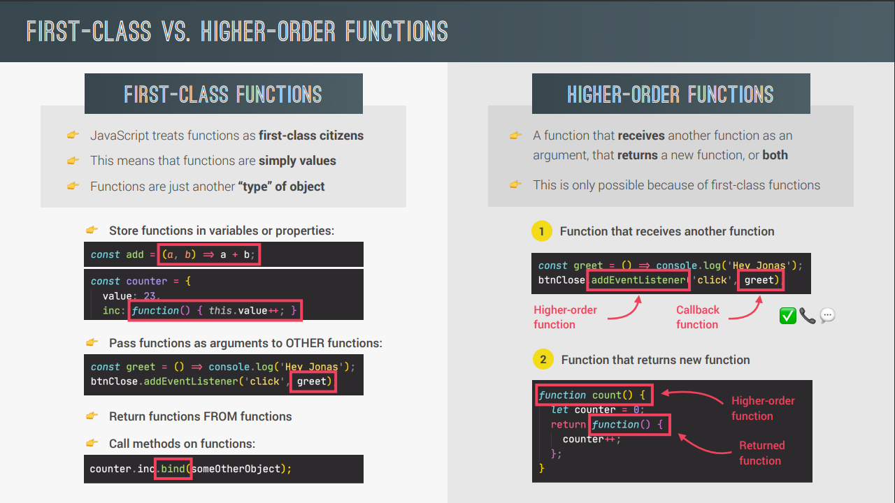
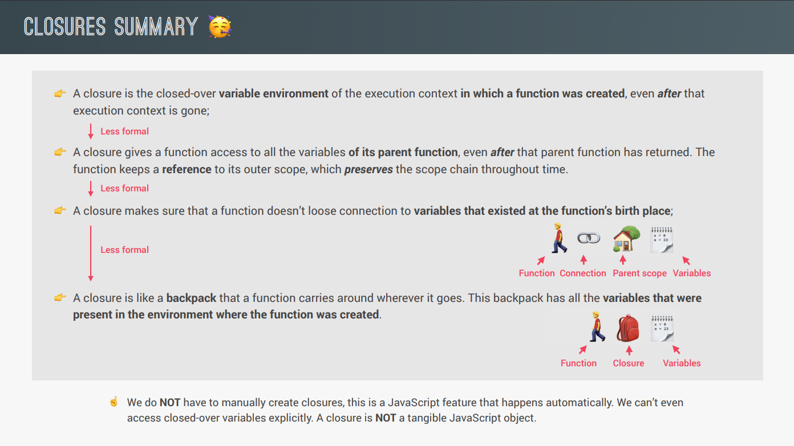
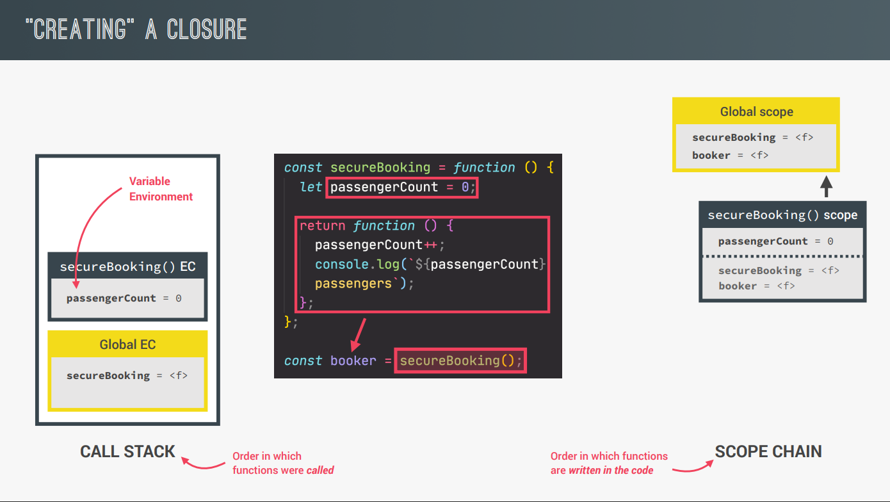
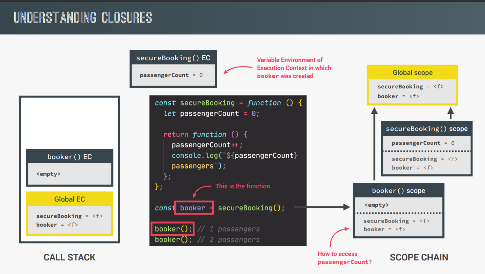

##### Table of content

- [Advanced JavaScript Function](#advanced-javascript-function)
  - [Default Parameters](#default-parameters)
  - [How Passing Arguments Works: Value vs Reference](#how-passing-arguments-works-value-vs-reference)
  - [First-Class and Higher-Order Functions](#first-class-and-higher-order-functions)
    - [Khái niệm](#khái-niệm)
    - [Functions Accepting Callback Functions](#functions-accepting-callback-functions)
    - [Functions Returning Functions](#functions-returning-functions)
  - [Function Methods: apply, call, bind](#function-methods-apply-call-bind)
    - [Call vs Apply](#call-vs-apply)
    - [Bind](#bind)
  - [Immediately Invoked Function Expressions (IIFE)](#immediately-invoked-function-expressions-iife)
  - [Closure](#closure)
    - [Định nghĩa](#định-nghĩa)
    - [Ứng dụng](#ứng-dụng)

# Advanced JavaScript Function

## Default Parameters

```
const bookings = [];
const createBooking = function (
  flightNum,
  numPassengers = 1,
  price = 199 * numPassengers
) {
  const booking = {
    flightNum,
    numPassengers,
    price,
  };
  console.log(booking);
  bookings.push(booking);
};

createBooking('LH123');
createBooking('LH123', 2, 800);
createBooking('LH123', 2);
createBooking('LH123', 5);
createBooking('LH123', undefined, 1000);
```

Tham khảo: [Default parameters](https://developer.mozilla.org/en-US/docs/Web/JavaScript/Reference/Functions/Default_parameters)

## How Passing Arguments Works: Value vs Reference

- Khi chúng ta truyền một đối số vào trong một function trong JavaScript thì đó sẽ truyền theo kiểu tham trị, tức là JavaScript sẽ tạo một vùng nhớ mới trong callstack và copy giá trị của biến được truyền vào cho vùng nhớ mới đó.
- Do đó khi chúng ta chúng ta truyền một **primitive variable** (string, number, boolean,..) vào trong một function thì khi chúng ta có thay đổi đối số đó trong function thì **primitive variable** ở bên ngoài sẽ không bị ảnh hưởng.
- Tuy nhiên khi chúng ta truyền vào một **reference variable** (như object, function, array,...) thì lại là một câu chuyện khác. Về bản chất JavaScript cũng sẽ tạo một vùng nhớ mới trong callstack và copy giá trị của biến được truyền vào, tuy nhiên đối với kiểu dữ liệu **Object** thì giá trị trong callstack sẽ là địa chỉ vùng nhớ của object đó trong heap, nên khi chúng ta thao tác với đối số trong function thì cũng tương tự như chúng ta đang thao tác với object đó bên trong heap, do đó **reference variable** ở bên ngoài cũng sẽ bị ảnh hưởng.

  ```
  const flight = 'LH234';
  const jonas = {
    name: 'Jonas Schmedtmann',
    passport: 24739479284,
  };
  const checkIn = function (flightNum, passenger) {
    flightNum = 'LH999';
    passenger.name = 'Mr. ' + passenger.name;
    if (passenger.passport === 24739479284) {
      alert('Checked in');
    } else {
      alert('Wrong passport!');
    }
  };
  // checkIn(flight, jonas);
  // console.log(flight);
  // console.log(jonas);
  // Is the same as doing...
  // const flightNum = flight;
  // const passenger = jonas;
  const newPassport = function (person) {
    person.passport = Math.trunc(Math.random() * 100000000000);
  };
  newPassport(jonas);
  checkIn(flight, jonas);
  ```

## First-Class and Higher-Order Functions

### Khái niệm



- First-class Function chỉ là một khái niệm trong JavaScript, khái niệm đó mô tả function tương tự như một giá trị.
- Higher-Order Function là một function có đối số truyền vào là một function hoặc một hàm return một function khác.

### Functions Accepting Callback Functions

```
const oneWord = function (str) {
  return str.replace(/ /g, '').toLowerCase();
};
const upperFirstWord = function (str) {
  const [first, ...others] = str.split(' ');
  return [first.toUpperCase(), ...others].join(' ');
};

// Higher-order function
const transformer = function (str, fn) {
  console.log(`Original string: ${str}`);
  console.log(`Transformed string: ${fn(str)}`);
  console.log(`Transformed by: ${fn.name}`);
};
transformer('JavaScript is the best!', upperFirstWord);
transformer('JavaScript is the best!', oneWord);

// JS uses callbacks all the time
const high5 = function () {
  console.log('👋');
};
document.body.addEventListener('click', high5);
['Jonas', 'Martha', 'Adam'].forEach(high5);
```

### Functions Returning Functions

```
const greet = function (greeting) {
  return function (name) {
    console.log(`${greeting} ${name}`);
  };
};
const greeterHey = greet('Hey');
greeterHey('Jonas');
greeterHey('Steven');
greet('Hello')('Jonas');

const greetArr = greeting => name => console.log(`${greeting} ${name}`);
greetArr('Hi')('Jonas');
```

## Function Methods: apply, call, bind

Phương thức `apply`, `call` và `bind` đều có chung một nhiệm vụ là định nghĩa context của từ khóa _this_ bên trong các function, tức là chúng ta sẽ định nghĩa đối tượng mà từ khóa _this_ trỏ tới.

### Call vs Apply

- Cả hai phương thức `call` và `apply` đều được sử dụng với chung mục đích là để gọi thực thi hàm, đồng thời cũng chỉ định đối tượng mà từ khóa this trỏ tới khi thực thi hàm.
- Điểm khác nhau giữa hai phương thức là `apply` sẽ truyền 1 mảng các tham số còn `call` sẽ truyền lần lướt các tham số.
- Một điều lưu ý là tham số đầu tiên lúc nào cũng là đối tượng để từ khóa this trỏ tới, các tham số còn lại là các đối số truyền vào.
- Cú pháp:

  ```
  call()
  Function.prototype.call(thisArg[, arg1[ , arg2, …]])
  apply()
  Function.prototype.apply(thisArg, argArray)
  ```

- Ví dụ:

  ```
  const lufthansa = {
    airline: 'Lufthansa',
    iataCode: 'LH',
    bookings: [],
    // book: function() {}
    book(flightNum, name) {
      console.log(
        `${name} booked a seat on ${this.airline} flight ${this.iataCode}${flightNum}`
      );
      this.bookings.push({ flight: `${this.iataCode}${flightNum}`, name });
    },
  };

  const eurowings = {
    airline: 'Eurowings',
    iataCode: 'EW',
    bookings: [],
  };

  const swiss = {
    airline: 'Swiss Air Lines',
    iataCode: 'LX',
    bookings: [],
  };

  lufthansa.book(239, 'Jonas Schmedtmann');
  lufthansa.book(635, 'John Smith');

  const book = lufthansa.book;
  // Does NOT work
  // book(23, 'Sarah Williams');

  // Call method
  book.call(eurowings, 23, 'Sarah Williams');
  console.log(eurowings);

  book.call(lufthansa, 239, 'Mary Cooper');
  console.log(lufthansa);

  book.call(swiss, 583, 'Mary Cooper');

  // Apply method
  const flightData = [583, 'George Cooper'];

  book.apply(swiss, flightData);
  console.log(swiss);

  book.call(swiss, ...flightData);
  ```

### Bind

- Khác với hai phương thức `call` và `apply`, phương thức `bind` sẽ trả về một hàm đã được định nghĩa đối tượng cụ thể sẽ bị ràng buộc cho con trỏ _this_.
- Ngoài việc ràng buộc với con trỏ _this_, chúng ta có thể sử dụng phương thức `bind` để làm Partial Application (set cứng các đối số cụ thể).

  ```
  const lufthansa = {
    airline: 'Lufthansa',
    iataCode: 'LH',
    bookings: [],
    // book: function() {}
    book(flightNum, name) {
      console.log(
        `${name} booked a seat on ${this.airline} flight ${this.iataCode}${flightNum}`
      );
      this.bookings.push({ flight: `${this.iataCode}${flightNum}`, name });
    },
  };

  const eurowings = {
    airline: 'Eurowings',
    iataCode: 'EW',
    bookings: [],
  };

  const swiss = {
    airline: 'Swiss Air Lines',
    iataCode: 'LX',
    bookings: [],
  };

  const book = lufthansa.book;

  const bookEW = book.bind(eurowings);
  const bookLH = book.bind(lufthansa);
  const bookLX = book.bind(swiss);

  bookEW(23, 'Steven Williams');

  const bookEW23 = book.bind(eurowings, 23);
  bookEW23('Jonas Schmedtmann');
  bookEW23('Martha Cooper');

  // With Event Listeners
  lufthansa.planes = 300;
  lufthansa.buyPlane = function () {
    console.log(this);
    this.planes++;
    console.log(this.planes);
  };
  document
    .querySelector('.buy')
    .addEventListener('click', lufthansa.buyPlane.bind(lufthansa));

  // Partial application
  const addTax = (rate, value) => value + value * rate;
  console.log(addTax(0.1, 200));

  const addVAT = addTax.bind(null, 0.23);
  // addVAT = value => value + value * 0.23;

  console.log(addVAT(100));
  console.log(addVAT(23));

  const addTaxRate = function (rate) {
    return function (value) {
      return value + value * rate;
    };
  };
  const addVAT2 = addTaxRate(0.23);
  console.log(addVAT2(100));
  console.log(addVAT2(23));
  ```

Tham khảo: [Bind, Apply and Call trong javascript](https://viblo.asia/p/bind-apply-and-call-trong-javascript-DzVGpoMDvnW)

## Immediately Invoked Function Expressions (IIFE)

```
const runOnce = function () {
  console.log('This will never run again');
};
runOnce();
// IIFE
(function () {
  console.log('This will never run again');
  const isPrivate = 23;
})();
// console.log(isPrivate);
(() => console.log('This will ALSO never run again'))();
{
  const isPrivate = 23;
  var notPrivate = 46;
}
// console.log(isPrivate);
console.log(notPrivate);
```

Tham khảo: [IIFE](https://developer.mozilla.org/en-US/docs/Glossary/IIFE)

## Closure

### Định nghĩa



```
const secureBooking = function () {
  let passengerCount = 0;
  return function () {
    passengerCount++;
    console.log(`${passengerCount} passengers`);
  };
};
const booker = secureBooking();
```



```
booker(); // 1 passengers
booker(); // 2 passengers
booker(); // 3 passengers
```




- Chúng ta có thể tạo ra closure mà không cần thiết phải return về một hàm:

  ```
  let f;
  const g = function () {
    const a = 23;
    f = function () {
      console.log(a * 2);
    };
  };

  const h = function () {
    const b = 777;
    f = function () {
      console.log(b * 2);
    };
  };

  g();
  f();
  console.dir(f);

  // Re-assigning f function
  h();
  f();
  console.dir(f);
  ```

- Ngoài ra chúng ta có thể tạo closure thông qua **Timer**:

  ```
  const boardPassengers = function (n, wait) {
    const perGroup = n / 3;
    setTimeout(function () {
      console.log(`We are now boarding all ${n} passengers`);
      console.log(`There are 3 groups, each with ${perGroup} passengers`);
    }, wait * 1000);
    console.log(`Will start boarding in ${wait} seconds`);
  };

  const perGroup = 1000; // Do closure có độ ưu tiên cao hơn scope chain nên các biến bên trong callback của setTimeout không truy cập vào global variable ở bên ngoài trước
  boardPassengers(180, 3);
  ```

Tham khảo:

1. [Closures](https://developer.mozilla.org/en-US/docs/Web/JavaScript/Closures)
2. [JavaScript Closures](https://viblo.asia/p/javascript-closures-PdbknoZLvyA)

### Ứng dụng

Chúng ta có thể ứng dụng closure trong rất nhiều trường hợp, sau đây sẽ là 2 ví dụ về ứng dụng closure:

1. Ứng dụng closure để tạo Logger

```
const createLogger = (prefix) => (message) =>
  console.log(`[${[prefix]}]\t${message}`);

const infoLogger = createLogger("INFO");
infoLogger("Đang xử lý lỗi.");

const errorLogger = createLogger("ERROR");
errorLogger('Biến "variable" chưa được khởi tạo.');
```

2. Ứng dụng closure để truy xuất dữ liệu trong Local Storage

```
const createStorage = (key) => {
  const store = JSON.parse(localStorage.getItem(key)) ?? {};

  const save = () => localStorage.setItem(key, JSON.stringify(store));

  return {
    get(key) {
      return store[key];
    },
    set(key, value) {
      store[key] = value;
      save();
    },
    remove(key) {
      delete store[key];
      save();
    },
  };
};

const profileSetting = createStorage("profile_setting");
profileSetting.set("fullName", "Nhan Phan");
profileSetting.set("age", 22);
profileSetting.set("gender", "male");
console.log(profileSetting.get("fullName"));

const studentSetting = createStorage("student_setting");
studentSetting.set("fullName", "Thanh Nhan");
studentSetting.set("studentID", 19521943);
studentSetting.set("department", "Computer Science");
studentSetting.remove("department");
console.log(studentSetting.get("studentID"));
```
