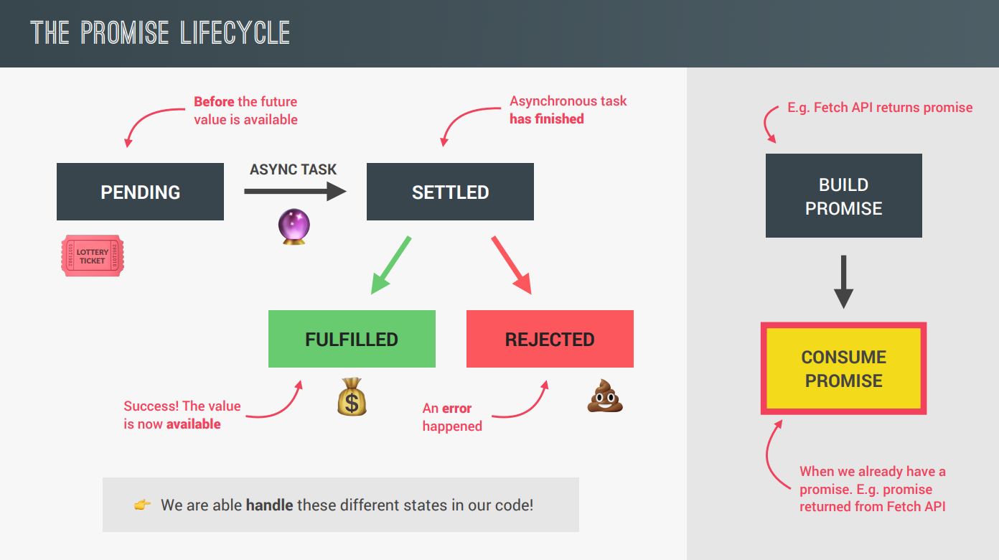
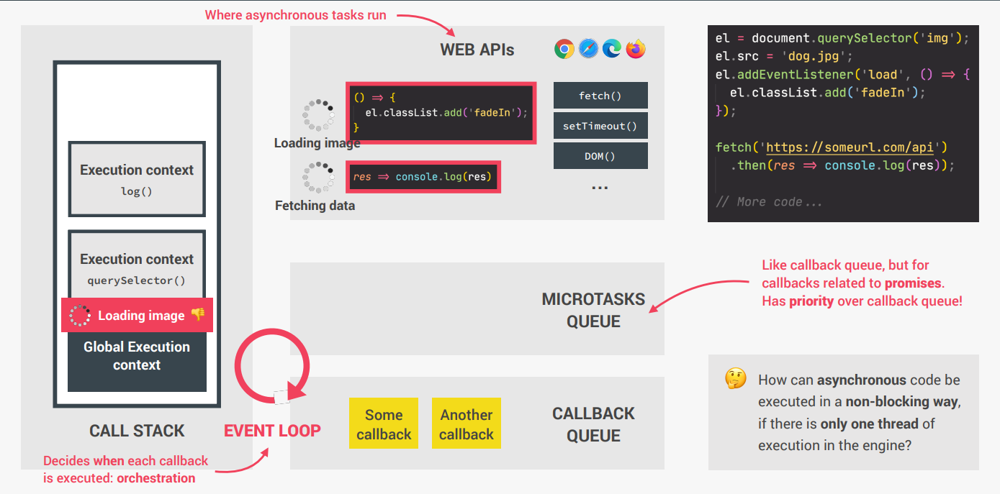

##### Table of content

- [Asynchronous JavaScript: Promises, Async/Await, and AJAX](#asynchronous-javascript-promises-asyncawait-and-ajax)
  - [Asynchronous JavaScript, AJAX and APIs](#asynchronous-javascript-ajax-and-apis)
    - [Asynchronous JavaScript](#asynchronous-javascript)
    - [AJAX](#ajax)
    - [APIs](#apis)
  - [Promise](#promise)
    - [Định nghĩa](#định-nghĩa)
    - [Promise Lifecycle](#promise-lifecycle)
    - [Promise Chain](#promise-chain)
    - [Promise đặc biệt](#promise-đặc-biệt)
    - [Bắt lỗi thủ công](#bắt-lỗi-thủ-công)
  - [Event Loop](#event-loop)

# Asynchronous JavaScript: Promises, Async/Await, and AJAX

## Asynchronous JavaScript, AJAX and APIs

### Asynchronous JavaScript

- JavaScript là ngôn ngữ đơn luồng (single-thread), cách thức hoạt động của JavaScript là thực thi các đoạn lệnh đồng bộ từ trên xuống, lệnh nào code trước sẽ được chạy trước.

  ```
  console.log(1);
  console.log(2);

  Output:
  1
  2
  ```

- Do tất cả các đoạn lệnh đều được thực thi từ trên xuống dưới, do đó những đoạn lệnh sau sẽ chờ các đoạn lệnh trước kết thúc thực thi.
- Tuy nhiên điều này sẽ sinh ra một vấn đề là khi một đoạn lệnh tốn nhiều thời gian để thực thi, dẫn đến các đoạn lệnh sau sẽ block và phải chờ đợi đoạn lệnh đó.

  ```
  const p = document.querySelector('.p')
  p.textContent = 'My name is Jonas'
  alert('Text set!')
  p.style.color = 'red'
  ```

Như đoạn code trên, khi đoạn lệnh alert thực thi thì ở trên browser sẽ hiển thị một cửa sổ, lúc này chương trình của chúng ta sẽ bị dừng, các đoạn code ở phía sau alert sẽ bị block, và chương trình sẽ tiếp tục thực thi khi nào người dùng bấm nào nút "OK" trên browser.

- Do đó để khắc phục vấn đề đó, chúng ta sẽ sử dụng "asynchronous code".
- "Asynchronous code" là cách lập trình theo kiểu bất đồng bộ, có nghĩa khi chương trình được thực thi, những đoạn lệnh bất đồng bộ sẽ chuyển sang một khu vực riêng để thực thi task của nó (nhất nút OK của phương thức alert, chờ thời gian của setTimeout,...).
- Do đó nó sẽ không ảnh hưởng tới luồng thực thi chính của chương trình. Điều đó đảm bảo các chương trình thực được thực thi liên tục, các đoạn code đồng bộ sẽ không bị block và không phải chờ đợi các đoạn code bất đồng bộ.
- Sau khi các đoạn code bất đồng bộ thực thi các task của nó xong, thì nó sẽ chuyển vô một hàng chờ (callback queue), thì lúc này sẽ có một đối tượng là event loop, nó sẽ kiểm tra lúc này luồng thực thi chính của chương trình (thread of execution - callstack) có task nào đang chạy hay không, nếu không có thì event loop sẽ đẩy từng phương thức bất đồng bộ vào luồng thực thi chính để thực thi, còn nếu luồng thực thi chính còn task thì những thằng trong callback queue sẽ phải chờ cho đến khi callstack rỗng.
- Một số ví dụ bất đồng bộ mà chúng ta thường bắt gặp như là: load một tấm ảnh, chạy bộ đếm thời gian, fetch API, AJAX,...
- Trong JavaScript lại có những phương pháp bất đồng bộ như: [setTimeout()](https://developer.mozilla.org/en-US/docs/Web/API/setTimeout), [setInterval()](https://developer.mozilla.org/en-US/docs/Web/API/setInterval), [fetch()](https://developer.mozilla.org/en-US/docs/Web/API/Fetch_API/Using_Fetch), [XMLHttpRequest()](https://developer.mozilla.org/en-US/docs/Web/API/XMLHttpRequest), [FileReader()](https://developer.mozilla.org/en-US/docs/Web/API/FileReader), [requestAnimationFrame()](https://developer.mozilla.org/en-US/docs/Web/API/window/requestAnimationFrame),.... Điều đó dẫn tới những đoạn lệnh không còn được chạy đồng bộ từ trên xuống như ban đầu.

  ```
  setTimeOut(function() {
    console.log(1);
  }, 1000);

  console.log(2);

  Output:
  2
  1
  ```

Nếu đúng như trong tư duy đồng bộ, thì khi JavaScript gặp đoạn code `setTimeOut()` ở trên, thì chương trình sẽ _sleep_ 1s rồi sau đó in ra số 1 trước rồi mới in ra số 2 sau, tuy nhiên do `setTimeOut()` là phương pháp bất đồng bộ nên đoạn lệnh in số 2 lại được thực thi trước sau đó mới tới lệnh in số 1.

### AJAX

- AJAX được viết tắt bởi **A**synchronous **J**avaScript **A**nd **X**ML.
- AJAX cho phép chúng ta giao tiếp với remote server theo cách bất đồng bộ.
- Chúng ta sẽ thực hiện các lệnh gọi AJAX để yêu cầu lấy dữ liệu từ server một cách linh hoạt mà không cần phải reload lại trang web.

### APIs

- API được viết tắt bởi **A**pplication **P**rogramming **I**nterface.
- API đơn giản là một ứng dụng được xây dựng để các ứng dụng sử dụng với mục đích giao tiếp, truyền tải dữ liệu giữa các ứng dụng.
- Có rất nhiều API khác nhau trong lập trình web, ví dụ như: **DOM API**, **Geolocation API**,...
- Chúng ta có thể tạo một API từ một object, trong đó cung cấp các method để có ứng dụng khác có thể tương tác sử dụng. Chúng ta gọi đó là **Own Class API**.
- **"Online" API** (Web API/API) là một API được xây dựng và chạy trên một remote server, API có chức năng cho phép client và server tương tác với nhau thông qua giao thức HTTP. Khi client gửi một request lấy dữ liệu thì API này sẽ có nhiệm vụ tiếp nhận request, tìm kiếm dữ liệu trong cơ sở dữ liệu và sau đó gửi data về cho client thong qua respone.
- Ngoài việc lấy dữ liệu thì chúng ta có thể sử dụng **"Online" API** cho nhiều task khác.

## Promise

### Định nghĩa

- Giả sử chúng cần xử lý những task bất đồng bộ có liên quan với nhau và có tính tuần tự, thì chúng ta bắt buộc vào lồng các callback function với nhau để xử lý, ví dụ:

  ```
  setTimeout(function () {
    console.log(1);
    setTimeout(function () {
      console.log(2);
      setTimeout(function () {
        console.log(3);
        setTimeout(function () {
          console.log(4);
        });
      });
    });
  });
  ```

- Tuy nhiên điều này dễ dẫn tới callback hell, thay vào đó chúng ta nên sử dụng một tính năng mới trong ES6 để xủ lý là **Promise**.


- Về cơ bản Promise là một object được sử dụng như một vùng chứa các giá trị không đồng bộ.
- Với việc sử dụng Promise sẽ giải quyết được vấn đề callback hell, thao tác các task có tính chất tuần tự dễ dàng hơn, code trong đẹp hơn và cũng như giúp chúng ta dễ dàng xử lý các thao tác bất đồng bộ hơn (ví dụ như AJAX call thì không cần phải sử dụng event "load").
- Cách khởi tạo Promise: dùng từ khóa new để khởi tạo Promise, tham số truyền vào một hàm thực thi (executor function).

  ```
  const promise = new Promise(
    // Executor function
    function (resolve, reject) {
      // Logic:
      // statement...

      // Gọi resolve khi thao tác xử lý logic thành công.
      // Tham số truyền vào là dữ liệu trả về cho phương thức then()
      resolve();

      // Gọi reject khi thao tác xử lý logic thất bại.
      // Tham số truyền vào là dữ liệu trả về cho phương thức catch()
      reject();
    }
  );
  ```

### Promise Lifecycle



- Promise có 3 trạng thái: pending (là trạng thái đang chờ resolve hoặc reject), fulfilled (là trạng thái khi promise thực thi thành công và gọi resolve), reject (là trạng thái khi promise thực thi thất bại và gọi reject).
- Các phương thức của Promise khi khởi tạo xong: then(), catch() và finally(); cả 3 phương thức đều nhận tham số là một callback function

  ```
  promise
    .then(function () {
      // Phương thức then được thực thi khi đối tượng Promise resolve, tham số truyền.
      // vào là giá trị được resolve trả về
      // statement...
    })
    .catch(function () {
      // Phương thức catch được thực thi khi đối tượng Promise reject, tham số truyền.
      // vào là giá trị được reject trả về
      // statement...
    })
    .finally(function () {
      // Phương thức finally sẽ được thực thi kể cả khi đối tượng Promise resolve
      // hoặc reject.
      // statement...
    });
  ```

- Ví dụ thực tế khi chúng ta đang cần lấy dữ liệu từ phía server, thì trong thời gian mà chúng ta đợi dữ liệu trả về thì chúng ta sẽ hiển thị loader, khi mà phía server phản hồi cho chúng ta rồi thì chúng ta sẽ sử dụng phương thức finally() để ẩn loader.
- Khi server xử lý thành công và trả về dữ liệu, thì dữ liệu sẽ được trả về thông qua resolve(-data-), rồi chúng ta sẽ sử dụng phương thức then(-data-) để render dữ liệu mà server trả về.
- Trong trường hợp server xử lý không thành công (không tìm thấy dữ liệu yêu cầu, rớt mạng,...) thì server sẽ trả về dữ liệu (error message,...) thông qua reject(-error message-), sau đó chúng ta sẽ sử dụng .catch(-error message-) để hiển thị trên browser.
- Một điều lưu ý quan trọng khi sử dụng Promise đó là lúc nào cũng phải có phương thức catch, bởi vì trong môi trường thực tế chúng ta không thể nào đảm bảo promise được sử lý thành công, đôi lúc sẽ có lỗi, nên chúng ta phải handle bug bằng phương thức catch() để xử lý cho phù hợp.

### Promise Chain

- Những phương thức của Promise có thể được viết thành chuỗi, và giá trị được return ở phương thức trước sẽ được trả về cho phương thức sau.

  ```
  const promise1 = new Promise(function (resolve) {
    resolve("Đây");
  });

  promise1
    .then((data) => `${data} được`)
    .then((data) => `${data} gọi`)
    .then((data) => `${data} là`)
    .then((data) => `${data} Promise Chain`)
    .then((data) => {
      console.log(data); // "Đây được gọi là Promise Chain"
    });
  ```

- Promise chain cũng sẽ áp dụng tương tự cho phương thức catch.
- Với Promise chúng ta có thể viết lồng vào nhau những phương thức cần thực thi tuần tự và ràng buộc với nhau, đồng thời cách trình bày của promise chain cũng sẽ hiểu và tường minh hơn so với callback hell.
- Một điều lưu ý là khi chúng ta return ở phương thức trước đó là một Promise, thì phương thức tiếp theo sẽ thực thi dựa trên Promise mới được sinh ra ở phương thức trước.

  ```
  const promise2 = new Promise(function (resolve) {
    resolve("Đây là Promise 1");
  });

  promise2
    .then(function (data) {
      console.log(data); // "Đây là Promise 1"
      return new Promise(function (resolve) {
        resolve("Đây là Promise 2");
      });
    })
    .then(function (data) {
      console.log(data); // "Đây là Promise 2"
    });
  ```

### Promise đặc biệt

- Ngoài việc tạo ra một Promise thông thường (xử lý logic ở bên trong, rồi tùy vào từng trường hợp gọi resolve hoặc reject), chúng ta có thể tạo ra các promise đặc biệt như sau:

  - Promise.resolve: tạo một promise luôn trả về resolve

    ```
    const resolvedPromise = Promise.resolve("Success!");
    resolvedPromise.then((data) => {
      console.log(data);
    });
    ```

  - Promise.reject: tạo một promise luôn trả về reject

    ```
    const rejectedPromise = Promise.reject("Error!");
    rejectedPromise.catch((errorMsg) => {
      console.log(errorMsg);
    });
    ```

  - Promise.all: được sử dụng khi chúng ta cần kết hợp và sử dụng dữ liệu của các promise, mà các promise lại không ràng buộc lẫn nhau, do đó thay vì phải chạy tuần tự các promise, chúng ta sẽ sử dụngg Promise.all để chạy song song các promise. Một điều lưu ý phương thức then() của promise all chỉ được thực thi khi các promise truyền vào phải được resolve, khi có 1 promise bị reject thì phương thức then() sẽ không được thực thi, mà sẽ thực thi phương thức catch().

    ```
    const promise3 = Promise.resolve([1]);
    const promise4 = Promise.resolve([2, 3]);
    Promise.all([promise3, promise4]).then(function (result) {
      const [result1, result2] = result;

      console.log(result1.concat(result2));
    });
    ```

### Bắt lỗi thủ công

- Trong thực tế chúng ta chỉ nên sử dụng phương thức catch để bắt error khi xảy ra trường hợp rớt mạng hoặc fetch API không thành công, còn các error khác chúng nên bắt thủ công. Bởi vì giả sử trong phương thức then có error do chúng ta lập trình (sử dụng biến undefined để truy xuất property,...) thì lúc này phương thức catch sẽ bắt error và hiển thị trên giao diện người dùng thì không hợp lý, do đó chúng ta phải cần bắt lỗi thủ công.
- Chúng ta sẽ bắt thủ công bằng cách sử dụng `throw new Error(errorMessage)`, lúc này chúng ta có thể chủ động được thông tin lỗi để phương thức catch bắt.

  ```
  const getJSON = (url, errorMsg = "Something went wrong") => {
    return fetch(url).then((response) => {
      if (!response.ok) {
        throw new Error(`${errorMsg} (${response.status})`);
      }

      return response.json();
    });
  };

  const getCountryData = (country) => {
    getJSON(`https://restcountries.com/v2/name/${country}`, "Country not found!")
      .then((data) => {
        console.log(data[0]);

        const [neighbour, ...rest] = data[0]?.borders;

        if (!neighbour) throw new Error("No neighbour found!");

        return getJSON(
          `https://restcountries.com/v2/alpha/${neighbour}`,
          "Country not found!"
        );
      })
      .then((data) => console.log(data, "neighbour"))
      .catch((err) => {
        console.error(err);
      })
      .finally(() => (countriesContainer.style.opacity = 1));
  };
  ```

- Khi chúng ta `throw new Error(errorMessage)` trong callback của phương thức then thì ngay lập tức promise sẽ reject ngay lập tức, callback sẽ lập tức bị terminate không còn return promise, và ngay lúc này phương thức catch sẽ bắt được lỗi mà chúng đã "throw".

## Event Loop



- Note: những callback của Promise sẽ được truyền vào micro-tasks queue và nó có độ ưu tiên cao hơn các callback trong callback queue thông thường, do đó các callback trong micro-tasks queue sẽ được ưu tiên đưa vào callstack thục thi trước toàn bộ rồi mới tới lượt các callback trong callback queue.

Tham khảo: [Hiểu về cơ chế xử lý sự kiện Event Loop trong Javascript](https://viblo.asia/p/hieu-ve-co-che-xu-ly-su-kien-event-loop-trong-javascript-07LKXjX2lV4)
