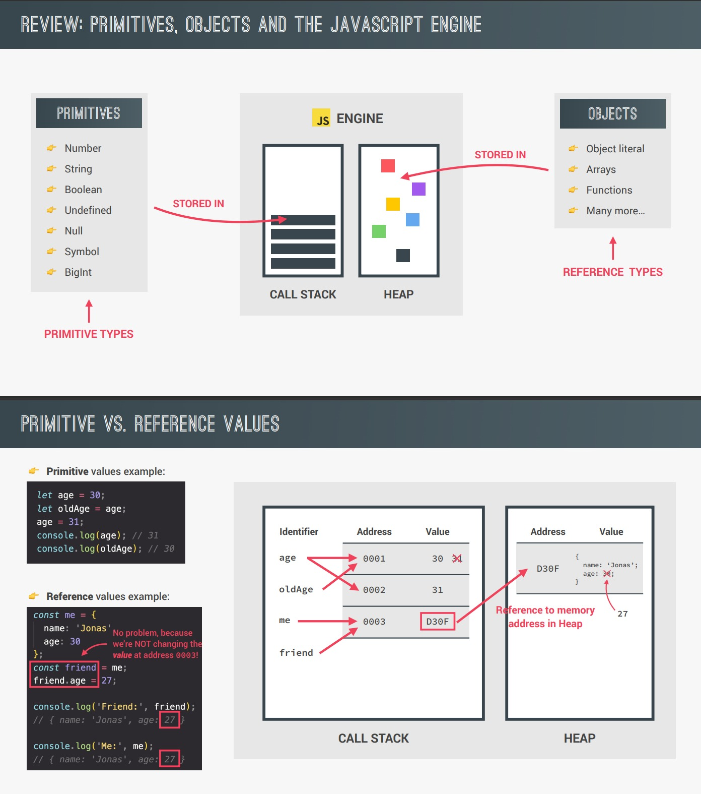

##### Table of content

- [How JavaScript Works Behind the Scenes](#how-javascript-works-behind-the-scenes)
  - [JavaScript?](#javascript)
  - [JavaScript Engine and Runtime](#javascript-engine-and-runtime)
  - [Execution Contexts and Callstack](#execution-contexts-and-callstack)
  - [Scope and The Scope chain](#scope-and-the-scope-chain)
  - [Hoisting and The TDZ (Temporal Dead Zone)](#hoisting-and-the-tdz-temporal-dead-zone)
  - ["This" keyword](#this-keyword)
  - [Primitive and Object](#primitive-and-object)

# How JavaScript Works Behind the Scenes

## JavaScript?

- JavaSript is a **"high-level"** **"prototype-bases object-oriented"** **"multi-paradigm"** **"interpreted or just-in-time compiled"** **"dynamic"** **"single-thread"** **"garbage-collected"** programming language with **"first-class function"** and a **"non-blocking event loop concurrency model"**.


## JavaScript Engine and Runtime


## Execution Contexts and Callstack


## Scope and The Scope chain


## Hoisting and The TDZ (Temporal Dead Zone)


- Một điều luw ý khi chúng ta khai báo biến bằng _var_ thì JS sẽ tạo property tương ứng trong window object, còn _let_ với _const_ thì không. Do đó không nên sử dụng _var_.

```
var firstName = "Nhan Phan";
let lastNam = "Phan";
console.log(window.firstName) // Nhan Phan
console.log(window.lastName) // Error
```

## "This" keyword


- Trong arrow function sẽ không có "context" của riêng nó, do đó từ khóa "this" sẽ không trỏ tới đối tượng gọi method với arrow function đó, mà nó sẽ trỏ tới đối tượng bên ngoài (cụ thể là đối tượng nằm ở parent scope).
- Do đó chúng ta không nên sử dụng arrow function để làm method cho một object.

```
// Ví dụ về lý do không nên sử dụng arrow function làm method và lý do không nên sử dụng var để khai báo biến.
const nhan = {
  firstName: "Nhan Phan",
  greet: () => {
    console.log(this);
    console.log(`Hello {this.firstName}`);
  };
  var firstName = "no name";

  nhan.greet()

  // Output:
  // Window {}
  // Hello no name
}
```

## Primitive and Object


